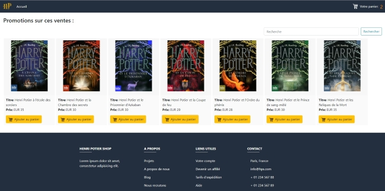
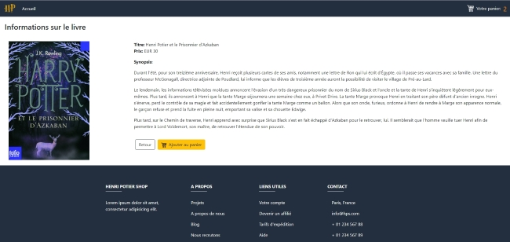
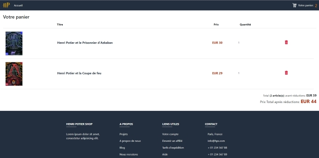

# Exercice Front-end : La bibliothèque d'Henri Potier

This project was generated with [Angular CLI](https://github.com/angular/angular-cli) version 8.1.2.

## Subject
 
The publisher asks you to develop an e-commerce website with two interfaces:
* The first one allows to display the books that one wishes to buy and to carry out a search
* The second recapitulates the cart where will be applied __the best possible commercial offer__.

## Development server

Run  `ng serve`  for a dev server. Navigate to  `http://localhost:4200/`. The app will automatically reload if you change any of the source files.

## Running unit tests

Run  `ng test`  to execute the unit tests via  [Karma](https://karma-runner.github.io/).

## Preview

## Further help

To get more help on the Angular CLI use  `ng help`  or go check out the  [Angular CLI README](https://github.com/angular/angular-cli/blob/master/README.md).